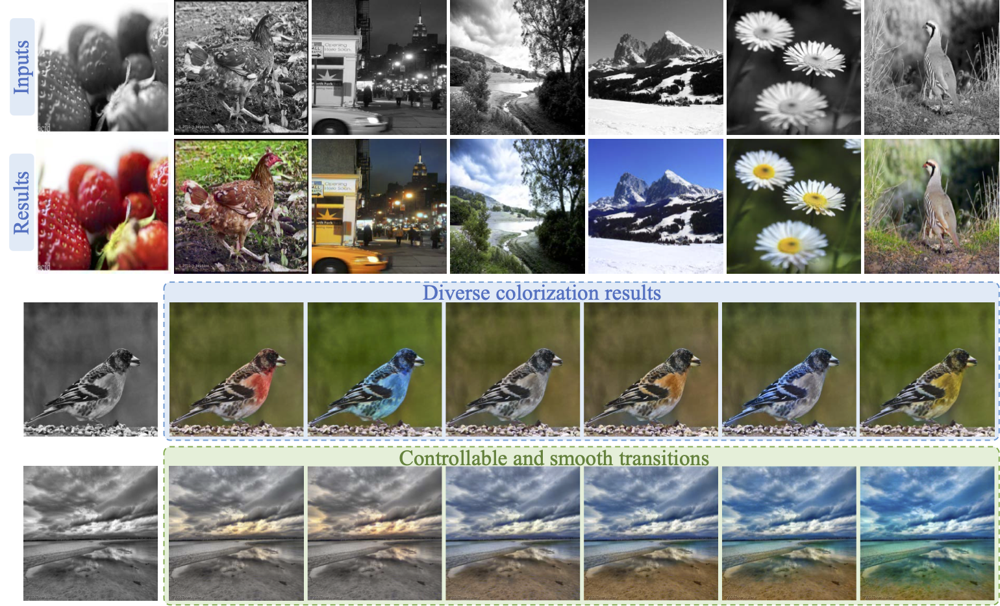

# GCP-Colorization (ICCV 2021)
Official code for ICCV 2021 paper "Towards Vivid and Diverse Image Colorization with Generative Color Prior".

The name of our method, **GCP-Colorization**, is short for **Colorization** with **G**enerative **C**olor **P**rior.


<p align="center">
  
</p>

## Installation
### Core dependencies
* CUDA >= 10.0 (test on 10.0 and 10.2)
* gcc >= 7.3
* pytorch >= 1.6 (test on 1.6 and 1.7.1)
* python3 (test on 3.8)

### Install DCN package
```shell
cd ops
python setup.py develop
```

## Download the Pre-trained Models

Download the pretrained models from [[Google Drive](https://drive.google.com/drive/folders/1-mwYyvF4nGbqI3x1dC-OruX0tru02JKE?usp=sharing) ] and put them into the `assets` folder.
If you want to reproduce or get the results reported in our ICCV 2021 paper for academic purpose, you can check [model zoo](model_zoo.md).
Otherwise, you just need to use the default options.

## Inference
### Test in the wild images
1. Predict ImageNet label (0-999) for these images
   1. install awesome timm, `pip install timm`
   2. use a SOTA classification model from timm to predict the labels
      ```shell
      python predict_imagenet_label.py testcase_in_the_wild --model beit_large_patch16_512 --pretrained
      ```
      here `testcase_in_the_wild` folder has the images you want to test
   3. you will get the label map in `assets/predicted_label_for_user_image.txt`

2. Inference colorization
    ```shell
    python main.py --expname inference_in_the_wild --test_folder testcase_in_the_wild DATA.FULL_RES_OUTPUT True
    ```
    ```Console
    options:
        --expname: the results will be saved in results/{expname}-{time} folder
        --inference_in_the_wild: contains the images you want to test
        --bs: batch size
        DATA.FULL_RES_OUTPUT: True or False. If set to True
                              the full resolution results will be saved in results/{expname}-{time}/full_resolution_results
                              batch size should be 1 if this flag is set to True
        DATA.CENTER_CROP: whether to center crop the input images.
                          This flag and DATA.FULL_RES_OUTPUT flag can not be both set to True
    ```
3. If everything goes well, you will get the results similar as [visual_results.md](visual_results_in_the_wild.md).


### Test images from ImageNet val set
* The most worry-free way is to make sure the images' names are **consistent** with the official ImageNet name.
Because we provide the GT ImageNet labels in [imagenet_val_label_map.txt](assets/imagenet_val_label_map.txt).
You can check `testcase_imagenet` for examples.
* Also, the test images should better be **color** images rather than grayscale images. If you want to test on grayscale images, please read the `read_data_from_dataiter` function from [base_solver.py](solvers/base_solver.py),
prepare the grayscale images following the pipeline and hack the related code.
* Inference
    ```shell
    python main.py --expname inference_imagenet --test_folder testcase_imagenet DATA.FULL_RES_OUTPUT False DATA.CENTER_CROP False
    ```
* If everything goes well, you will get the following quantitative results on the full 50,000 ImageNet validation images (yes, FID is better than the number reported in our ICCV 2021 paper)

  | eval@256x256 | FID↓ | Colorfulness↑ | ΔColorfulness↓ |
  | :-----| ----: | :----: | :----: |
  | w/o center crop | 1.325 | 34.89 | 3.45 |
  | w/ center crop | 1.262 | 34.74 | 4.12 |

### TODO
- [ ] add colab demo (PR welcomed)
- [ ] replace current DCN with compiling-free torchvision version `torchvision.ops.deform_conv2d` (PR welcomed)

## Citation
If you find this project useful for your research, please consider citing our paper:
```bibtex
@inproceedings{wu2021towards,
  title={Towards vivid and diverse image colorization with generative color prior},
  author={Wu, Yanze and Wang, Xintao and Li, Yu and Zhang, Honglun and Zhao, Xun and Shan, Ying},
  booktitle={Proceedings of the IEEE/CVF International Conference on Computer Vision},
  year={2021}
}
```

## Acknowedgement
This project borrows codes from [CoCosNet](https://github.com/microsoft/CoCosNet), [DGP](https://github.com/XingangPan/deep-generative-prior), and [BigGAN-PyTorch](https://github.com/ajbrock/BigGAN-PyTorch).
DCN code from early version of [mmcv](https://github.com/open-mmlab/mmcv). predict_imagenet_label.py from [timm](https://github.com/rwightman/pytorch-image-models).
Thanks the authors for sharing their awesome projects.
